This HOWTO uses the following references:

* https://projects.eclipse.org/projects/iot.embed-cdt
* [Deprecated, but useful Nordic DevZone HOWTO set up Eclipse for nRF development](Nordic_DevZone_tutorial.pdf)

This HOWTO is aimed at providing nRF52xxx _without_ Bluetooth development support. The example project treats the nRF52xxx as a bare-metal processor.

See `Set up nRF52 command line env.md`. This HOWTO assumes that command line devevelopment works.

**The first 15 steps are only needed for initial Eclipse installation and set up.**

1. Install Eclipse for embedded development; i.e. Eclipse Embedded CDT (C/C++ Development Tools).
2. Do an update for good measure.
3. Change directory to the main project directory as defined in the `Set up nRF52 command line env` 
```
cd ~/Development/Spartan
```
4. From Eclipse create a workspace folder in the SDK
```
mkdir sdk/workspace

ls -l sdk/              
total 2952
drwxrwxr-x 14 knud    4096 Aug 23  2021 components/
drwxrwxr-x  8 knud    4096 Aug 21  2021 config/
drwxrwxr-x  2 knud    4096 Aug 21  2021 documentation/
drwxrwxr-x 16 knud    4096 Aug 21  2021 examples/
drwxrwxr-x 24 knud    4096 Aug 21  2021 external/
drwxrwxr-x  3 knud    4096 Aug 21  2021 external_tools/
drwxrwxr-x  3 knud    4096 Aug 21  2021 integration/
-rw-rw-r--  1 knud      93 Aug 21  2021 license.txt
drwxrwxr-x  3 knud    4096 Aug 21  2021 modules/
-rw-rw-r--  1 knud 2981888 Aug 21  2021 nRF_MDK_8_40_3_IAR_BSDLicense.msi
drwxrwxr-x  2 knud    4096 Aug 27 17:10 workspace/
```
   (you can delete the `*.msi` file as it's not needed)
   
5. Now refer to the Nordic DevZoneHOWTO linked above.
6. We've already done in [Set up nRF52 command line env](Set up nRF52 command line env) the first part where a command line environment is set up and the `peripheral/blinky` example is compiled and verified so we can skip down to the "Setting up Eclipse the first time" section.
7. Since the tutorial is a bit old, the part asking to "Install GNU ARM Eclipse plug-in" that refers to this [site](http://gnuarmeclipse.github.io/plugins/install/) is out of date. The latest [site](https://eclipse-embed-cdt.github.io/plugins/install/) recommends just installing the [**Eclipse IDE for Embedded C/C++ Developers**](https://www.eclipse.org/downloads/packages/)
	1. It already has
	   * the **Eclipse IDE for C/C++ Developers** standard distribution with
	   * the **Eclipse Embedded CDT plug-ins** including the 
	        * GNU ARM C/C++ Cross Compiler
	        * GNU ARM C/C++ Packs
	        * GNU ARM C/C++ J-link Debugging
8. Let's move on to the section **Install device family pack for the nRF5x series (optional)**
9. Open the "Packs" perspective as instructed and refresh the perspective to download a list of all the available Packs. <span style="color:darkred">This takes a long time</span>
10. As shown in the screenshots below, install the following:
	1. ARM/CMSIS
	2. ARM/CMSIS-Compiler
	3. ARM/CMSIS-Driver_Validation
	4. ARM-Packs/Unity
	5. NordicSemiconductor/all

      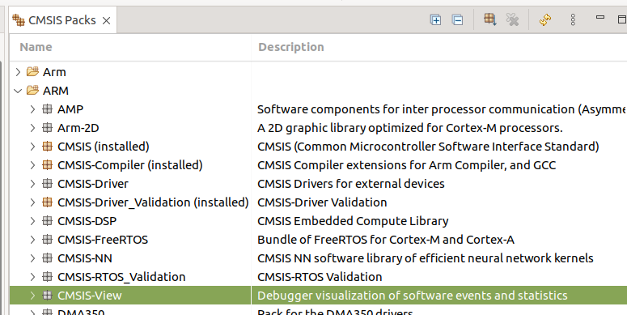 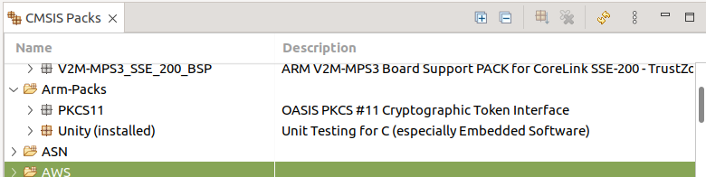
      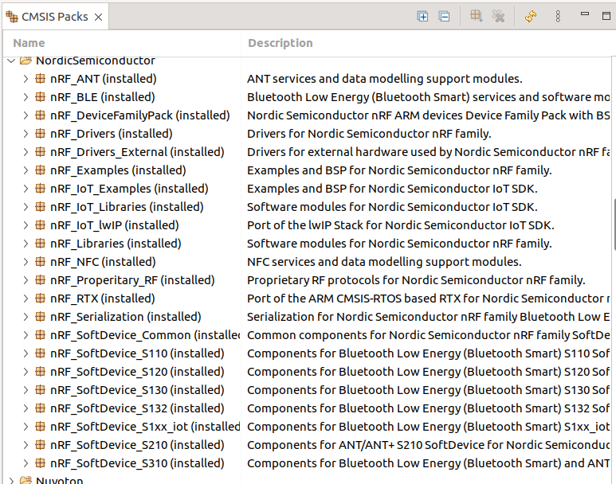
		
11. We can confirm the installation of Nordic Semi packs in the Devices window as shown below
      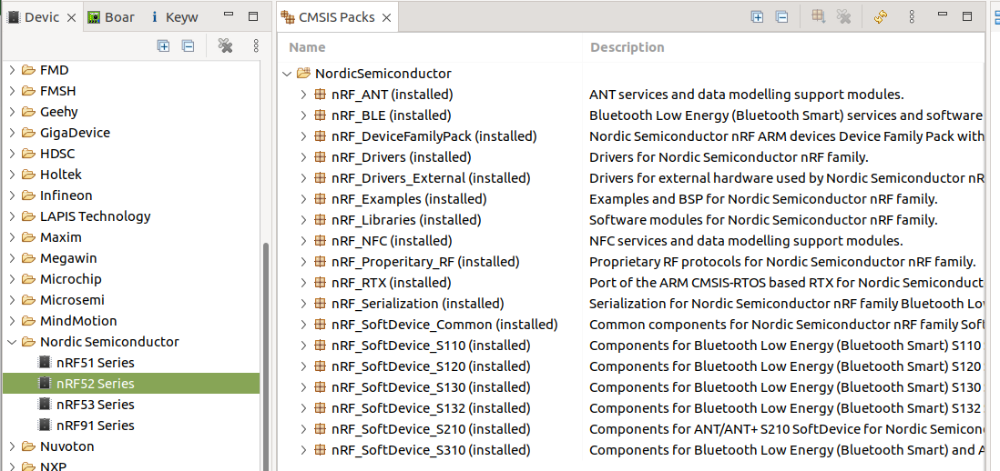
12. Now we want to check the toolchain settings and set for the specific cross-compiler needed for projects using the nRF52 SDK.
13. In Eclipse under the Window menu open the Preferences and select and expand the "MCU" item.
14. The "Global SEGGER J-Link Path" should be fine for us, should resemble the image below.
      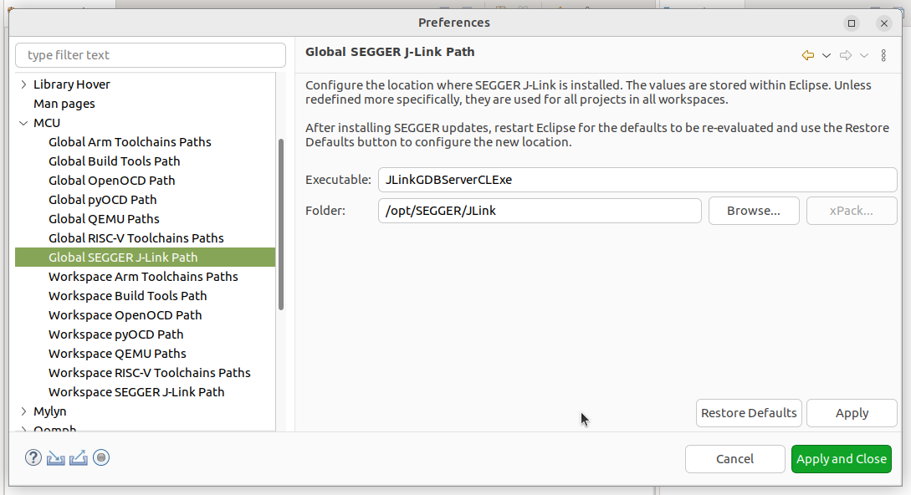
16. We need a custom toolchain path. Select the "Workspace Arm Toolchains Paths" item and set to point to the gcc toolchain folder we installed in the "Set up nRF52 command line env". Set the "Default toolchain" to custom. It should resemble the image below
      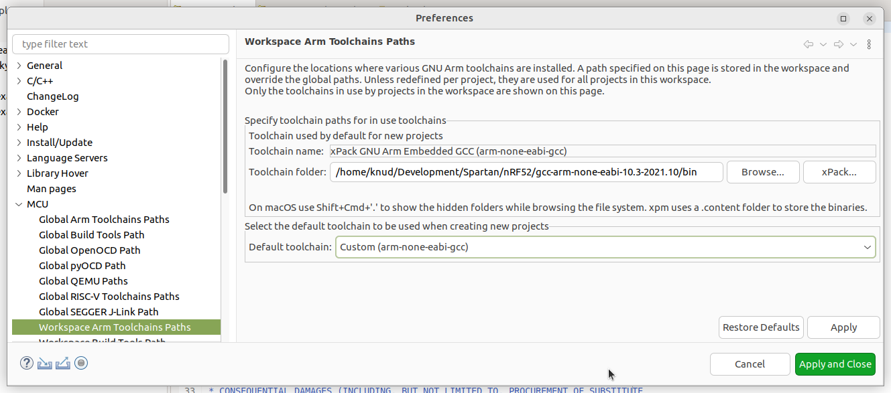
16. The following steps need to be done for each new project.
17. Let's test this setup with the same example from the "Set up nRF52 command line env" HOWTO. Again, we start on the command line and make a copy of the `blinky` example.
18. For the first project using a specific board make a board-specific folder in the workspace. Here we will use the nRF52840-DK, which is designated as `pca10056` for the SDK
```
cd ~/Development/Spartan/sdk/workspace
mkdir nRF52840_DK
```
19. Make a new project folder in the `workspace/nRF52840_DK` folder we defined above and copy the example files.
```
cd nRF52840_DK
mkdir -p blinky/pca10056/blank
cd blinky
cp -dpR ../../../examples/peripheral/blinky/pca10056/blank/armgcc pca10056/blank/
cp -dpR ../../../examples/peripheral/blinky/pca10056/blank/config pca10056/blank/
cp ../../../examples/peripheral/blinky/main.c .
```
20. The result should resemble the following
```
ls -lR                  
.:
total 8
-rw-rw-r-- 1 knud 2752 Aug 27 18:15 main.c
drwxrwxr-x 3 knud 4096 Aug 27 18:14 pca10056/

./pca10056:
total 4
drwxrwxr-x 4 knud 4096 Aug 27 18:15 blank/

./pca10056/blank:
total 8
drwxrwxr-x 2 knud 4096 Aug 27 17:32 armgcc/
drwxrwxr-x 2 knud 4096 Aug 21  2021 config/

./pca10056/blank/armgcc:
total 12
-rw-rw-r-- 1 knud 1204 Aug 21  2021 blinky_gcc_nrf52.ld
-rw-rw-r-- 1 knud 4997 Aug 21  2021 Makefile

./pca10056/blank/config:
total 68
-rw-rw-r-- 1 knud 68820 Aug 21  2021 sdk_config.h
```
21. In Eclipse, select File/New/Makefile Project with Existing Code.
	1. Enter project name, e.g., `blinky`
	2. Enter `~/Development/Spartan/sdk/workspace/nRF52840_DK/blinky
	3. Select ARM Cross GCC
           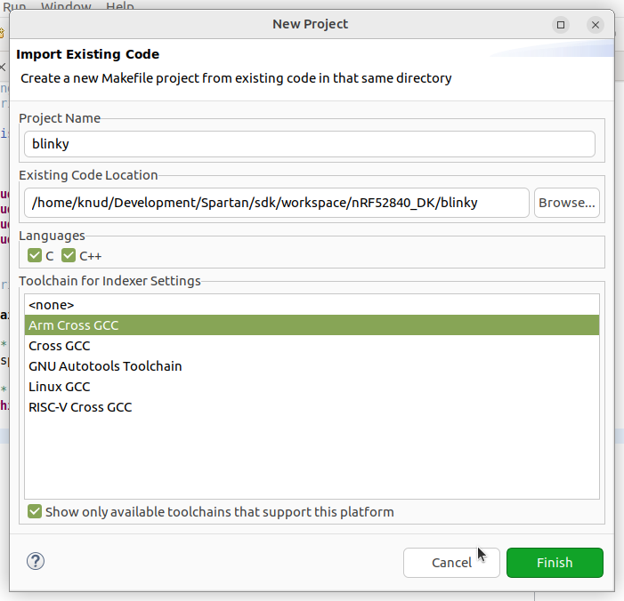
22.  In Eclipse, open the `Makefile`, which is under the folder `pca10056/blank/armgcc`
	1. Change `PROJECT_NAME` if you want.
	2. Change `OPT = -O3 -g3` to `OPT = -O0 -g3` for debugging to produce expected results.
	3. If we are using a custom board, change the board name in the `CFLAGS` and `ASMFLAGS` lines; e.g. we might define `BOARD_SPARTAN_IOTA_V1`
	4. Save the changes
23. In Eclipse, right-click the project folder and select the Properties and select the C/C++ Build section. In the Builder Settings tab, change the Build command to be `make` and append the relative path to the `Makefile` to the path in the Build directory and click Apply. The dialogue should resemble the one below.
    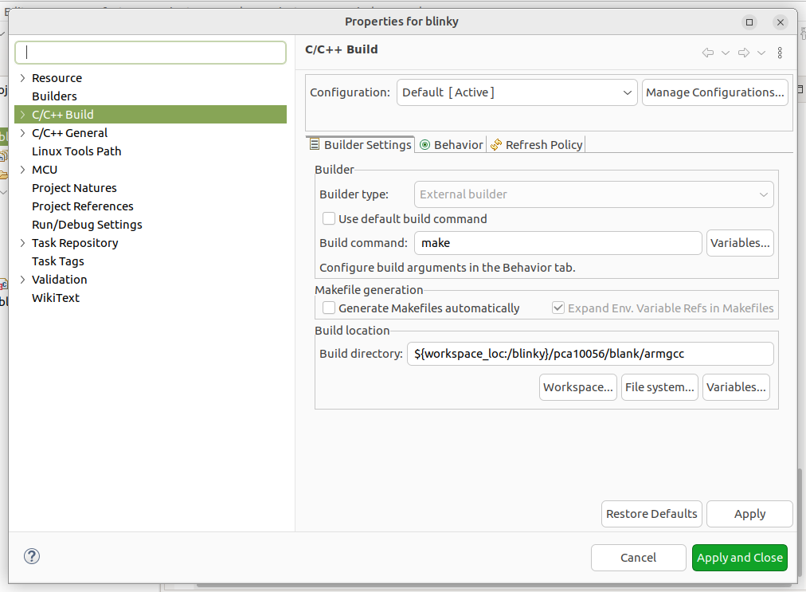
24. Now select the Behavior tab and select Use custom build arguments, disable the Build on resource save, remove the variable "all" from the Build (incremental build) line, and click Apply and Close. The dialogue should resemble the one below
    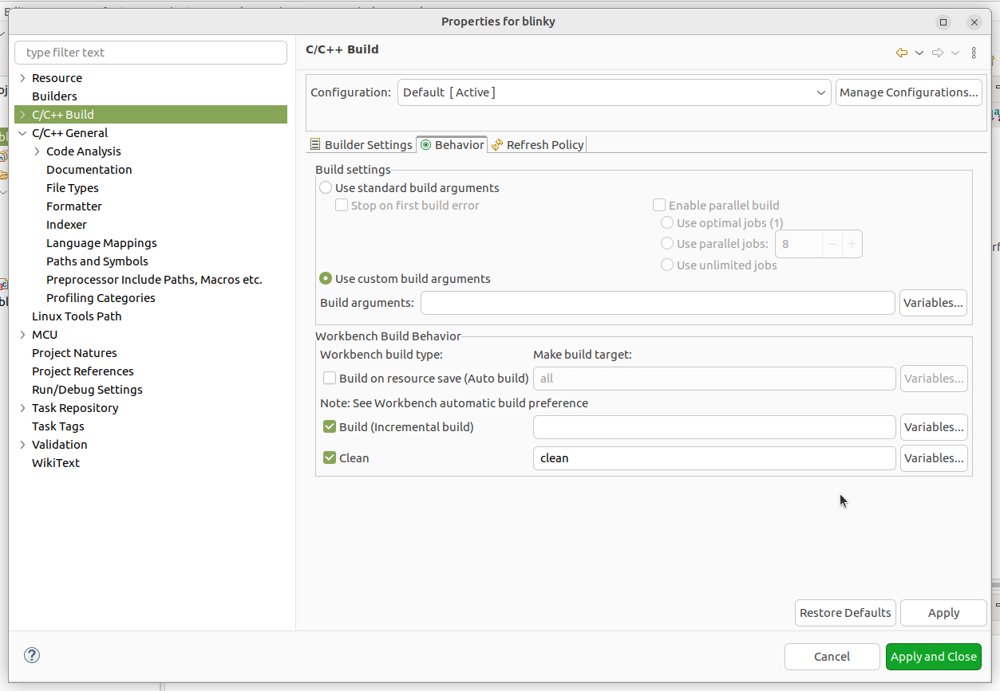
25. Let's test cleaning and building. Right click on the project folder and select Clean Project. The console should show
```
12:54:17 **** Clean-only build of configuration Default for project blinky ****
make clean
rm -rf _build

12:54:18 Build Finished. 0 errors, 0 warnings. (took 1s.101ms)
```
26. Now right click the project folder and select Build Project. The console should show
```
12:56:20 **** Build of configuration Default for project blinky ****
make
mkdir _build
cd _build && mkdir nrf52840_xxaa
Assembling file: gcc_startup_nrf52840.S
Compiling file: nrf_log_frontend.c
Compiling file: nrf_log_str_formatter.c
Compiling file: boards.c
Compiling file: app_error.c
Compiling file: app_error_handler_gcc.c
Compiling file: app_error_weak.c
Compiling file: app_util_platform.c
Compiling file: nrf_assert.c
Compiling file: nrf_atomic.c
Compiling file: nrf_balloc.c
Compiling file: nrf_fprintf.c
Compiling file: nrf_fprintf_format.c
Compiling file: nrf_memobj.c
Compiling file: nrf_ringbuf.c
Compiling file: nrf_strerror.c
Compiling file: nrfx_atomic.c
Compiling file: main.c
Compiling file: system_nrf52840.c
Linking target: _build/nrf52840_xxaa.out
text data bss dec hex filename
3448 108 28 3584 e00 _build/nrf52840_xxaa.out
Preparing: _build/nrf52840_xxaa.hex
Preparing: _build/nrf52840_xxaa.bin
DONE nrf52840_xxaa

12:56:22 Build Finished. 0 errors, 0 warnings. (took 1s.886ms)
```
27. Next we set up a build target to flash the `.hex` file to the target.
28. Right click the project folder and select Build Targets/Create. Make a new target named `flash` as shown below and save.
    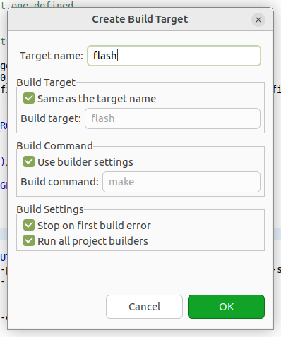
29. This will invoke the `flash` section of the `Makefile`, which uses the Nordic Semi tool `nrfjprog`. **There can be a problem** depending on where it and the other tools have been installed. In some cases a soft link gets make. To check this, find the `nrfjprog` program using `which` and check for soft link;
```
which nrfjprog
/usr/local/bin/nrfjprog

pca10056/blank/armgcc via 🅒 base …
➜ ls -l /usr/local/bin/nrfjprog         
lrwxrwxrwx 1 root 40 Aug 10 17:48 /usr/local/bin/nrfjprog -> /opt/nrf-command-line-tools/bin/nrfjprog*
```
30. If there is no soft link, then step 29 can be skipped
31. We see that the actual program is in the directory `/opt/nrf-command-line-tools/bin`. This needs to be made explicit in the `Makefile` so we will make a path variable.
	1. Open the `Makefile` and add below the `PROJ_DIR := ../../..` entry a new line that has `NRF_COMMAND_LINE_TOOLS_DIR := /opt/nrf-command-line-tools/bin/`. (use the actual path you find to the `nrfjprog` program, of course)
	2. Find near the end of the `Makefile` the `Flash the program` section. Prepend the `nrfjprog` commands with `$(NRF_COMMAND_LINE_TOOLS_DIR)/` so that it resembles
	```
	# Flash the program
    flash: default
        @echo Flashing: $(OUTPUT_DIRECTORY)/nrf52840_xxaa.hex
        $(NRF_COMMAND_LINE_TOOLS)/nrfjprog --snr 600109906 -f nrf52 --program $(OUTPUT_DIRECTORY)/nrf52840_xxaa.hex --sectorerase --verify
        $(NRF_COMMAND_LINE_TOOLS)/nrfjprog --snr 600109906 -f nrf52 --reset
    ```
	3. Once the change is made, open a new terminal and `echo $PATH` to confirm the change is made
	4. Note: the inclusion of `--snr 600109906` is necessary to identify my J-Link Plus. It's probably okay to remove that argument...
32. Now we are ready to flash the program to the target. 
33. As a result of step 26 above, we now have in our project folder a `Build Targets` entry. Open it to display our `flash` target as shown below.
      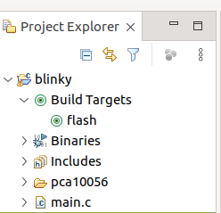
34. Double-click the `flash` target. In the console we should see somthing like the following. (I had changed the `main.c` file, so Eclipse automatically recompiled and linked everthing)
```
13:51:08 **** Build of configuration Default for project blinky ****
make flash
Compiling file: main.c
Linking target: _build/nrf52840_xxaa.out
text data bss dec hex filename
3448 108 28 3584 e00 _build/nrf52840_xxaa.out
Preparing: _build/nrf52840_xxaa.hex
Preparing: _build/nrf52840_xxaa.bin
DONE nrf52840_xxaa
Flashing: _build/nrf52840_xxaa.hex
/opt/nrf-command-line-tools/bin//nrfjprog --snr 600109906 -f nrf52 --program _build/nrf52840_xxaa.hex --sectorerase --verify

[ ###### ] 0.000s | Erase file - Check image

[ ##### ] 0.000s | Check image validity - Initialize device info

[ ########## ] 0.000s | Check image validity - Check region 0 settings

[ ############### ] 0.000s | Check image validity - block 1 of 2

[ #################### ] 0.009s | Check image validity - Finished

[ ############# ] 0.000s | Erase file - Erasing

[ ########## ] 0.000s | Erasing non-volatile memory - block 1 of 1

[ #################### ] 0.000s | Erasing non-volatile memory - Erase successful

[ #################### ] 0.110s | Erase file - Done erasing

[ ###### ] 0.000s | Program file - Checking image

[ ##### ] 0.000s | Check image validity - Initialize device info

[ ########## ] 0.000s | Check image validity - Check region 0 settings

[ ############### ] 0.059s | Check image validity - block 1 of 2

[ #################### ] 0.006s | Check image validity - Finished

[ ############# ] 0.000s | Program file - Programming

[ ########## ] 0.000s | Programming image - block 1 of 1

[ #################### ] 0.000s | Programming image - Write successful

[ #################### ] 0.025s | Program file - Done programming

[ ###### ] 0.000s | Verify file - Check image

[ ##### ] 0.000s | Check image validity - Initialize device info

[ ########## ] 0.000s | Check image validity - Check region 0 settings

[ ############### ] 0.074s | Check image validity - block 1 of 2

[ #################### ] 0.005s | Check image validity - Finished

[ ############# ] 0.000s | Verify file - Verifying

[ ########## ] 0.000s | Verifying image - block 1 of 1

[ #################### ] 0.000s | Verifying image - Verify successful

[ #################### ] 0.023s | Verify file - Done verifying
/opt/nrf-command-line-tools/bin//nrfjprog --snr 600109906 -f nrf52 --reset
Applying system reset.
Run.

13:51:13 Build Finished. 0 errors, 0 warnings. (took 5s.35ms)
```
35. It's time to set up for interactive debugging.
	1. We will use a Segger J-Link Plus, but many other J-Link versions will work including EDU.
	2. The target is the nRF52840-DK, which will be powered via the nRF USB port.
		1. This means that the dev kit will not show up as a memory device on the host development computer. It will be programmed and debugged using the SWD Debug In interface connected to the J-Link
36. In Eclipse, under the Run menu select Debug configurations.
37. In the left window, select the GDB SEGGER J-Link Debugging entry and click the New launch configuration icon at the top left (it looks like a blank page with a yellow plus sign)
38. Give the new configuration a name, such as `blinky debug` and click Apply. The dialogue should resemble the one below
    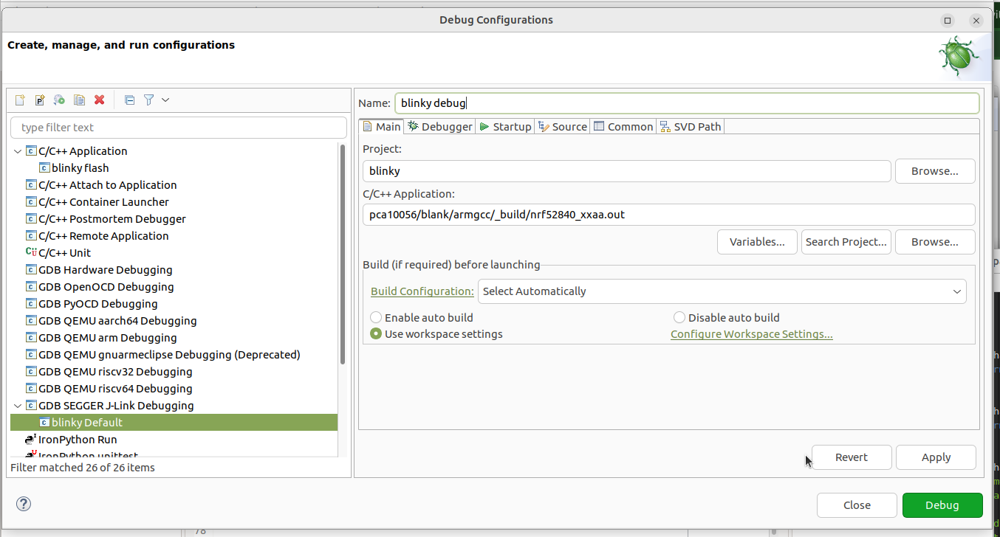
39. Select the Debugger tab.
40. Change the Device name to `Cortex-M4` since that is the ARM in the nRF52840. The dialogue should resemble
    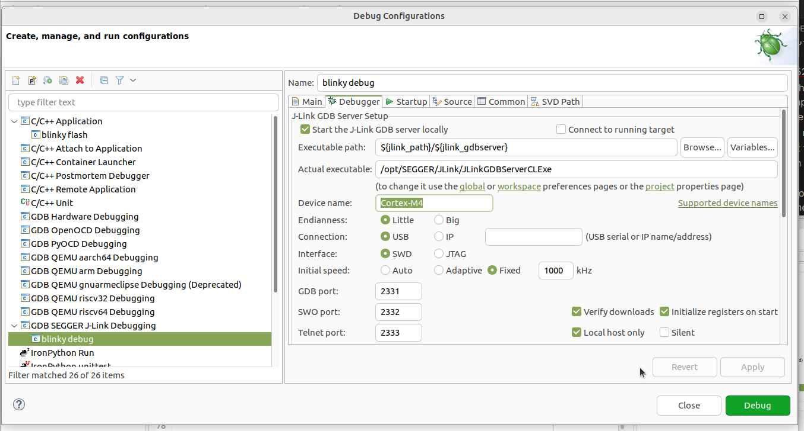
41. Scroll down to the GDB Client Setup section. 
42. For the Executable name, browse to find the `arm-none-eabi-gdb` program directory. It will be under the nRF52 directory where we put the ARM GCC toolchain in the `Set up nRF52 command line env` HOWTO. In my case the path is
```
/home/knud/Development/Spartan/nRF52/gcc-arm-none-eabi-10.3-2021.10/bin/arm-none-eabi-gdb
```
43. The dialogue should resemble
    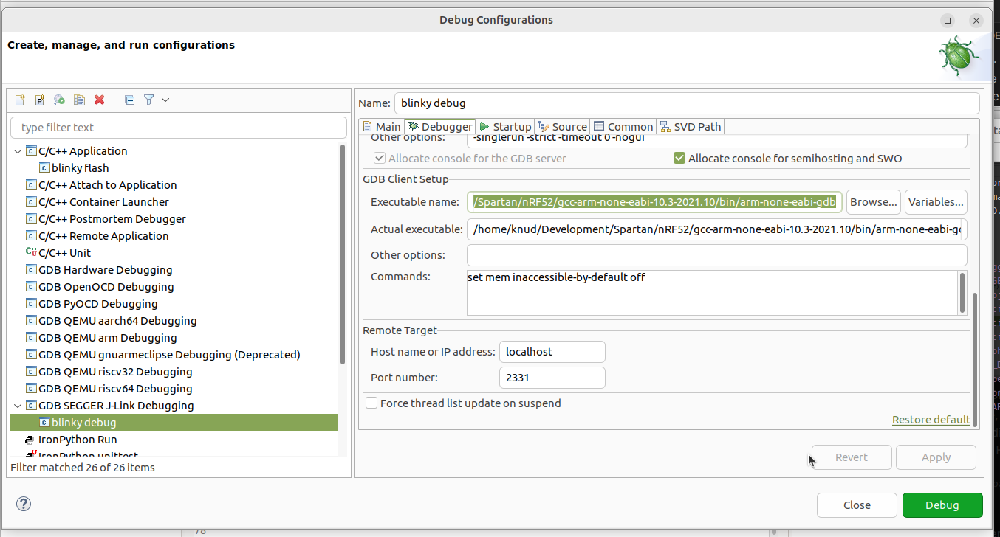
44. Click Apply.
45. Now we can try this out by either clicking Debug in the dialogue, or dismissing it and selecting under the Run menu the Debug History/blinky debug entry (which will be there after the first time the configuration is run). Either way the result should be to bring up the debug perspective in Eclipse and you can step or do whatever in the code. See below
    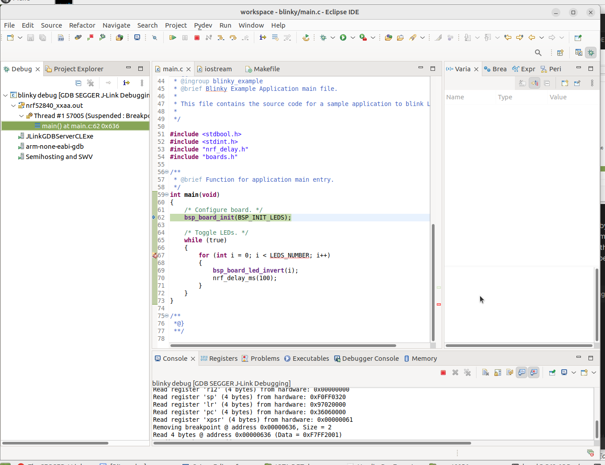
46. Finally, let's set up the SDK configuration tool (CMSIS Configuration Wizard). It's a Java-based tool that simplifies managing the `sdk_config.h` file, which can be several thousand lines long(!).
47. On Linux it's likely the installation has only the headless JDK, so install the full one. On Ubuntu 22.04/23.04, execute in a terminal
    ```
    sudo apt install openjdk-17-jdk
    ```
48. Similar to the flash build target made in step 27, make an `sdk_config` build target. Name the target `sdk_config` and leave the 
    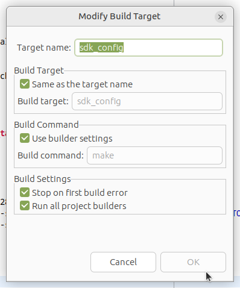)
49. Try the configuration wizard by double-clicking the new build target. The result should resemeble
    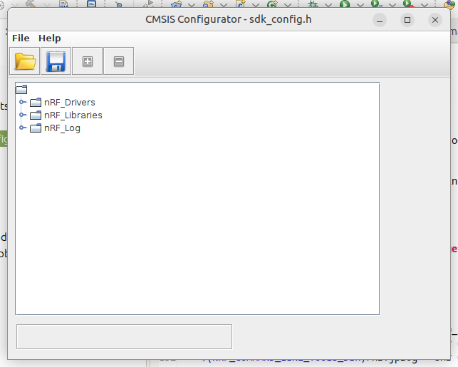
50. This HOWTO is complete.
