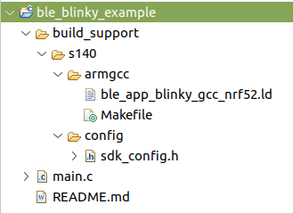

This HOWTO uses the following references:

* https://projects.eclipse.org/projects/iot.embed-cdt
* https://content.u-blox.com/sites/default/files/NINA-B3_DataSheet_UBX-17052099.pdf

We assume we're using the NINA-B306 family and according to the datasheet softdevice S140 is recommended.

This HOWTO is aimed at providing nRF52xxx with Bluetooth development support. The example project is built to include Bluetooth support.

See `Set up nRF52 command line env.md`. This HOWTO assumes that command line dev works.

1. We assume Eclipse for embedded development; i.e. Eclipse Embedded CDT (C/C++ Development Tools) in installed and running.
	1. The HOWTO for setting up Eclipse is `Set up Eclipse for nRF52 dev under Linux`
2. Do an update for good measure.
3. ****************** **KSK stopped here; more to do**
5. We'll set up an example project that can then be copied to be the basis of other projects. For this we choose the `ble_peripheral/blinky` example and target the nRF52840-DK (pca10056).
7. In Eclipse, make a new project named `ble_blinky_example`. Choose an "Empty or Existing CMake Project" template.
	1. The default project location should be `~/Development/Spartan/workspace` in the dialogue.
8. In Eclipse, create in `ble_blinky_example` the folder tree `build_support/s140/armgcc`
9. 8. In Eclipse, create in `ble_blinky_example` the folder tree `build_support/s140/config`
10. Copy the linker, make, and config files from the example. The config file defines things like GPIO mappings
```
cp sdk/examples/ble_peripheral/ble_app_blinky/pca10056/s140/armgcc/* workspace/ble_blinky_example/build_support/s140/armgcc/
cp sdk/examples/ble_peripheral/ble_app_blinky/pca10056/s140/config/sdk_config.h workspace/ble_blinky_example/build_support/s140/config
```
10. Copy the example `main.c` to the project.
```
cp sdk/examples/ble_peripheral/ble_app_blinky/main.c workspace/ble_blinky_example/
```
11. It's always good to have a README file, so make one using `touch README.md`
12. The project navigator should resemble the image below
    
12. Since the files have been moved around, if we try to make the example now paths will be broken. We need to make some changes to the `Makefile`
13. Edit the `Makefile` (e.g., in Eclipse, but emacs or vim work as well...). Change the line (at this time, line 5) that reads `SDK_ROOT := ../../../../../..` to `SDK_ROOT := ../../../../../sdk`
14. Change the linegoto (at this time, line 154) that reads `SDK_CONFIG_FILE := ../config/sdk_config.h` to `SDK_CONFIG_FILE := sdk_config.h`
