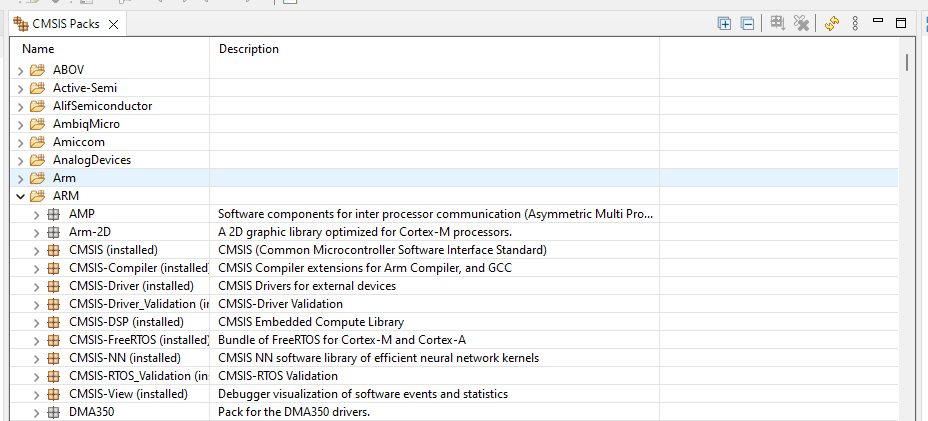
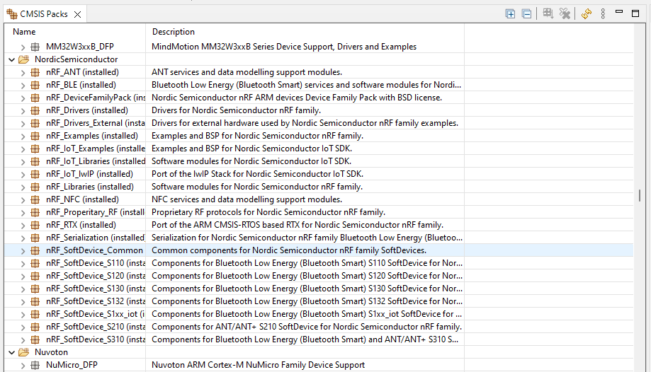
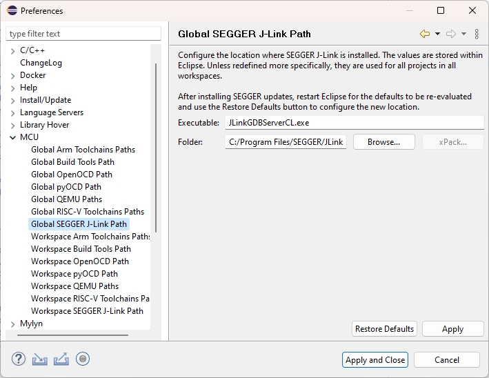
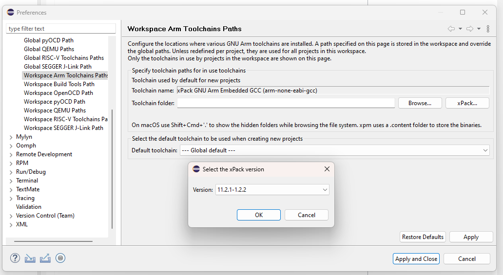
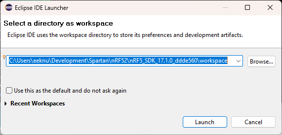
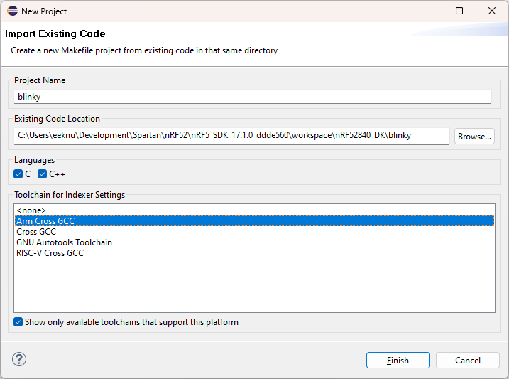
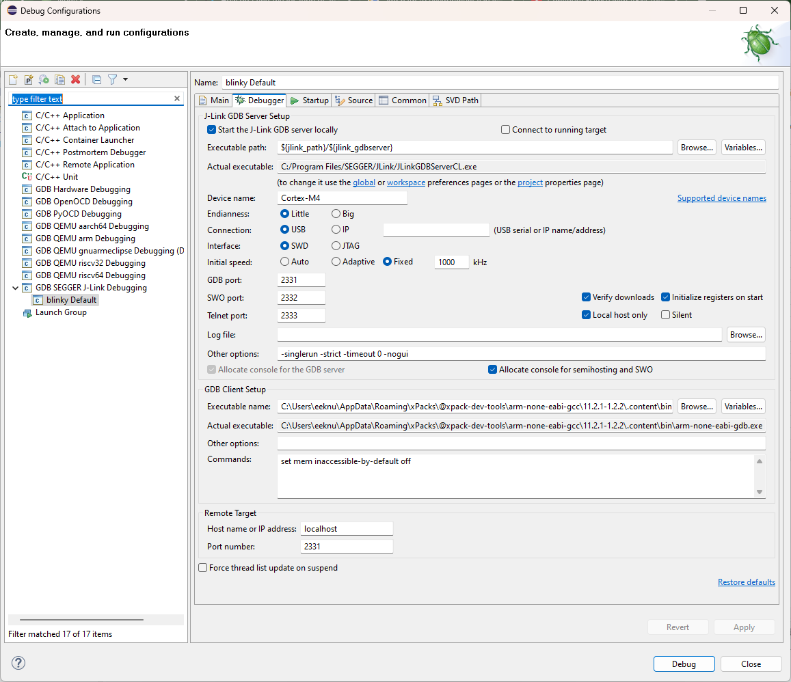

1. Install Eclipse IDE for Embedded C/C++ Developers using [Eclipse installer](https://www.eclipse.org/downloads/packages/)
2. Launch, update Help/Check for Updates; update everything.
	1. We'll set the workspace later, so for now just accept the default location
3. Launch, open CMSIS Packs perspective found under the Window/Perspective/Open Perspective/Other... menu
	1. Refresh by clicking the counter clockwise yellow arrows near the top right of the CMSIS Packs window
	2. ignore all download errors
4. Right-click to install
   * ARM/CMSIS* -- all
   * Nordic Semiconductor -- all
     
     
5. Next we set up the file hierarchy to be used to develop nRF52 code.       ```
6. Open a Command window and make a development folder structure to support all FW dev using the following commands. `nRFResources` is where we will keep some things we download and `nRF52` is where we will place the SDK. Under the SDK is where the Eclipse workspace will be located.
   ```
   mkdir Development
   mkdir Development\Spartan
   mkdir Development\Spartan\nRF52
   mkdir Development\Spartan\nRFResources
    ```
7. Next we need the nRF command line tools needed to program and debug the board. Download the [nRF command line tools](https://www.nordicsemi.com/Products/Development-tools/nrf-command-line-tools/download), version 10.23.0 into `nRFResources` 
	1. Double-click to install
	2. Accept all the defaults. Various support software including from SEGGER will be installed as well.
	3. Let's first test that the tools are installed by opening a Command window and typing `nrfjprog --version`. The result should resemble the output below
   ```
   C:\Users\eeknu>nrfjprog --version
   nrfjprog version: 10.23.0 external
   JLinkARM.dll version: 7.88j
   ```
8. We will install the GCC toolchain using xpacks as per this [blog](https://blog.reds.ch). Look under the Tutorials category (on the right as of 20231004) and look for "eclipse for nRF5 SDK installation guide"
9. As per the blog, download and install the latest version (20.8.0) of [NodeJS](nodejs.org/en) and install
10. Open a Command terminal and install npm, xpm, and the GCC toolchain and supports
    ```
    npm install --global npm@latest
    npm install --global xpm@latest
    xpm install --global @xpack-dev-tools/windows-build-tools@4.3.0-1.1
    xpm install --global @xpack-dev-tools/arm-none-eabi-gcc@11.2.1-1.2.2
    xpm install --global @xpack-dev-tools/openocd@latest
    ```
11. Now we want to check the toolchain settings and set for the specific cross-compiler needed for projects using the nRF52 SDK.
12. We will check that the various tools are set properly. In Eclipse under the Window menu open the Preferences and select and expand the "MCU" item and select the "Global SEGGER J-Link Path" item.The default should be fine for us, should resemble the image below.
      
13. Next, select the "Workspace Arm Toolchains Paths" item. This is where the compiler, debugger, and other tools are located. Click on the xPack... button which should result in a popup showing the version installed. Click OK to dismiss.
      

15. We will check the toolchain is correct in the blinky example.
16. Download the [nRF52 SDK from Nordic](https://www.nordicsemi.com/Products/Development-software/nrf5-sdk/download) into `nRFResources`. For this HOWTO, 17.1.0 is the latest. The various soft devices and the SDK are bundled into a single zip file, `DeviceDownload.zip`
17. Unzip the SDK into the folder `nRF52`
	1. When complete, you may delete the file `nRF5_SDK_17.1.0_ddde560/nRF_MDK_8_40_3_IAR_BSDLicense.msi` as we are using Eclipse and it's not supported by the MDK tools and extensions
18. The folder name `nRF5_SDK_17.1.0_ddde560` is specific to this release of the SDK. For convenience you may want to make an alias in the `Development\Spartan` folder named `sdk` 
19. The location of the GCC toolchain needs to be known by the SDK make scripts.
	1. Change to `Development\Spartan\nRF52\nRF5_SDK_17.1.0_ddde560\components\toolchain\gcc`
		1. If you are still in the `Spartan` directory and created the alias, just `cd sdk\components\toolchain\gcc` or `cd nRF5_SDK_17.1.0_ddde560\components\toolchain\gcc`
	2. Edit the `Makefile.windows` file and change to look like
	   ```
	   GNU_INSTALL_ROOT := C:/Users/eeknu/AppData/Roaming/xPacks/@xpack-dev-tools/arm-none-eabi-gcc/11.2.1-1.2.2/.content/bin/
       GNU_VERSION := 11.2.1
       GNU_PREFIX := arm-none-eabi
       ```
	3. Of course, the user name will not be `eeknu`, so replace with yours. I am not sure the slash direction matters.
	4. Save and exit the editor
20. To keep the make paths as close to the SDK-defined paths as possible, we are going to put the Eclipse workspace in the SDK folder. Open the Command window and change to `Development\Spartan\nRF52\nRF5_SDK_17.1.0_ddde560`, then make a `workspace` directory. Listing the directories in `Development\Spartan\nRF52\nRF5_SDK_17.1.0_ddde560` show looks something like below
    ```
    drwxrwxrwx 1 knud knud 4096 Aug 23  2021 components
    drwxrwxrwx 1 knud knud 4096 Aug 21  2021 config
    drwxrwxrwx 1 knud knud 4096 Aug 21  2021 documentation
    drwxrwxrwx 1 knud knud 4096 Aug 21  2021 examples
    drwxrwxrwx 1 knud knud 4096 Aug 21  2021 external
    drwxrwxrwx 1 knud knud 4096 Aug 21  2021 external_tools
    drwxrwxrwx 1 knud knud 4096 Aug 21  2021 integration
    -rwxrwxrwx 1 knud knud   93 Aug 21  2021 license.txt
    drwxrwxrwx 1 knud knud 4096 Aug 21  2021 modules
    drwxrwxrwx 1 knud knud 4096 Sep 12 19:28 workspace
    ```
15. Start Eclipse and set the workspace to the directory just created.
    
16. Now let's make the `blinky` example project
17. We'll follow the steps starting at #18 in the "Set up Eclipse for nRF52 dev under Linux" guide
18. At step 21, the dialogue will look like below because the path for Windows is different than under Linux
    
19. Steps 29-31 should not be necessary to have the flash target command work.
20. After steps 40-43, the debug dialogue will resemble the image below. The main difference between the Linux HOWTO and here is that the GDB executable path will be Windows-based and refer to the xpacks instance.
    
21. At this point, you can click Debug and the target will be programmed and the debugger will start.
19. This HOWTO is complete.